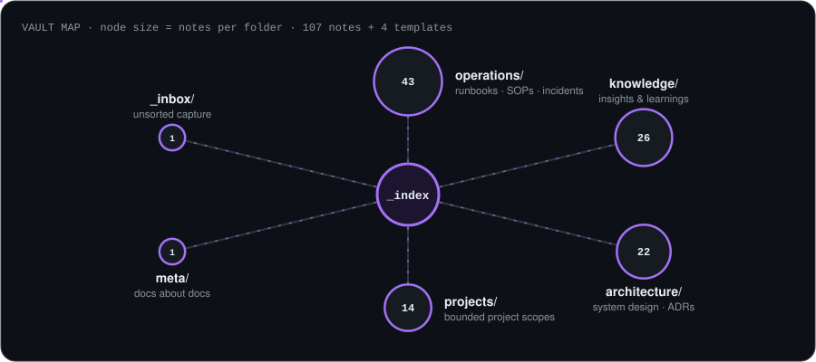

> [!NOTE]
> **Archived.** This repo is part of [Cortex](https://github.com/cortex-io), which is no longer under active development. It is kept as a working record: explore, fork and borrow freely, but no fixes or features are planned.

<p align="center"><sub><a href="https://github.com/cortex-io"><b>Cortex</b></a> &nbsp;·&nbsp; <a href="https://github.com/cortex-io/cortex">cortex</a> · <a href="https://github.com/cortex-io/cortex-platform">cortex-platform</a> · <a href="https://github.com/cortex-io/cortex-gitops">cortex-gitops</a> · <a href="https://github.com/cortex-io/cortex-k3s">cortex-k3s</a> · <b>cortex-docs</b> · <a href="https://github.com/cortex-io/cortex-construction-hq">cortex-construction-hq</a> · <a href="https://github.com/cortex-io/infrastructure-docs">infrastructure-docs</a></sub></p>

## What's here

An Obsidian vault holding the Cortex knowledge base: architecture decision records, operational runbooks, extracted insights and project scopes. Open `vault/` in [Obsidian](https://obsidian.md) for the linked graph, or browse the Markdown right here.



## Layout

```
vault/
├── _index.md        # map of content: start here
├── operations/      # 43 notes: runbooks, SOPs, incident response
├── knowledge/       # 26 notes: extracted insights and learnings
├── architecture/    # 22 notes: system design, ADRs, diagrams
├── projects/        # 14 notes: bounded project scopes
├── meta/            # docs about the docs
└── _inbox/          # unsorted capture
templates/           # component, decision, knowledge-extract, runbook
```

The vault was also set up to publish as a [MkDocs Material](https://squidfunk.github.io/mkdocs-material/) site (`mkdocs.yml`).

---

<p align="center"><sub>Part of the <a href="https://github.com/cortex-io">Cortex archive</a> · built with Claude</sub></p>
